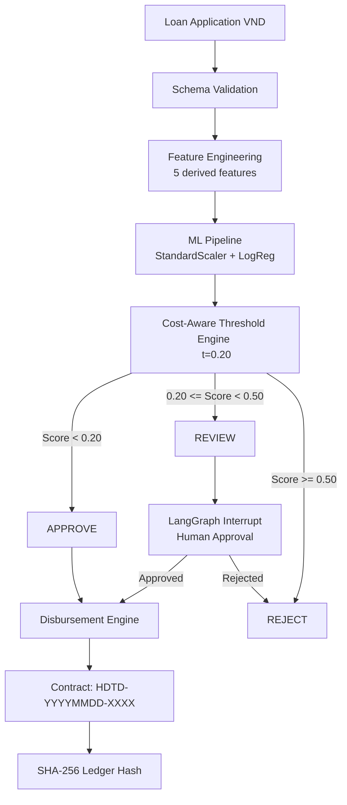

# 🏦 CreditFlow — ML Credit Risk Decision Engine

[](https://python.org)
[](https://fastapi.tiangolo.com)
[](https://reactjs.org/)
[](https://xgboost.readthedocs.io/)
[](https://scikit-learn.org/)
[](https://mlflow.org/)
[](https://www.docker.com/)
[]()
[](LICENSE)

**CreditFlow** is a production-grade ML credit risk decision support system tailored for financial lending. Moving beyond simple notebook exercises, this is a fully deployable decision engine with a complete pipeline: **data validation → feature engineering → model training → evaluation → serving → monitoring**.

Designed with enterprise requirements in mind, it features audit trails, human-in-the-loop approval workflows, explainability, and rigorous cost-sensitive model selection.

---

## ✨ Key Features & Engineering Decisions

1. **Business-Driven Model Selection**: Evaluated Logistic Regression, Decision Tree, Random Forest, and XGBoost. The model was selected based on a **custom business cost metric**, not raw accuracy. 
2. **Cost-Sensitive Threshold Tuning**: Optimized for asymmetric costs (False Negative cost=5.0 for missed defaults, False Positive cost=1.0 for wrong rejections), resulting in an optimal decision threshold of `0.20`.
3. **Winning Model**: **Logistic Regression** (Business Cost=201, Recall=0.80, F1=0.57) outperformed XGBoost on the business cost metric and was selected for production.
4. **Robust Feature Engineering**: Engineered 5 derived features (`debt_to_income`, `loan_to_income`, `debt_to_loan`, `employment_stability`, `credit_history_year_ratio`) with zero-division guards and robust handling of edge cases.
5. **Stateful Decision Workflow**: Leverages **LangGraph** for a 10-node state machine that handles human interrupts for `REVIEW` decisions, pausing and resuming workflows asynchronously.
6. **Core-Banking Ledger Integration**: Employs SQLite with deterministic contract codes (`HDTD-YYYYMMDD-XXXX`) and **SHA-256 tamper-evident hashes** for the disbursement ledger.
7. **Explainable AI**: Integrates Cloudflare Workers AI (Llama 3.2-1b) to generate Vietnamese natural language explanations for decisions (with fallback templates). The LLM *explains*, it does *not* decide.
8. **Production Monitoring**: Includes **PSI (Population Stability Index)** drift detection to track feature and prediction distribution shifts against baselines.
9. **Fraud Detection**: Rule-based deterministic fraud flags integrated upstream of the ML pipeline.
10. **Print-Ready Decision Slips**: Browser printing optimized with `@media print` CSS, featuring signature lines for loan officers and branch managers.
11. **Comprehensive MLOps**: Full experiment tracking, model registry, and artifact versioning powered by **MLflow**.

---

## 🏗 Architecture

The system orchestrates the flow of a loan application through validation, feature engineering, ML scoring, policy rules, and final disbursement.



---

## 🛠 Tech Stack

| Category | Technologies |
|---|---|
| **Backend** | Python 3.12, FastAPI, Pydantic v2, Uvicorn |
| **ML & Data** | scikit-learn, XGBoost, Pandas, NumPy, Joblib |
| **MLOps & Monitoring** | MLflow 3.16, PSI Drift Detection |
| **Workflow & GenAI** | LangGraph, LangChain, Cloudflare Workers AI (Llama 3.2-1b) |
| **Frontend** | React 18, Vite, Vanilla CSS |
| **Storage & Ledger** | SQLite (with SHA-256 tamper-evident hashing) |
| **DevOps** | Docker, Docker Compose, GitHub Actions, Render, GitHub Pages |

---

## 🚀 Quick Start

### Prerequisites
- Python 3.12+
- Node.js 18+
- Docker & Docker Compose (optional but recommended)

### Option 1: Docker Compose (Recommended)
```bash
# Spin up the entire stack (Backend + Frontend + DB)
docker compose up --build -d
```

### Option 2: Local Development
#### Backend
```bash
# Install dependencies
pip install -r requirements.txt

# Start the FastAPI server
uvicorn backend.app:app --reload --port 8080
```

#### Frontend
```bash
# Navigate to frontend and start the dev server
cd frontend
npm install
npm run dev
```

#### MLOps (Training & Tracking)
```bash
# Run model training pipeline with MLflow tracking
MLFLOW_TRACKING_URI=sqlite:///mlflow.db python scripts/train_models.py

# Launch MLflow UI
mlflow ui --port 5000
```

---

## 🔌 API Reference

The backend provides a comprehensive REST API for predictions, workflow management, and monitoring.

### Core Endpoints
- `GET /health` - Service health and production model status
- `POST /predict` - Immediate ML prediction (synchronous)
- `GET /model/info` - Production model metadata and benchmark metrics
- `GET /metrics` - Runtime metrics and benchmark table
- `GET /drift` - PSI drift report for monitoring distribution shift
- `GET /llm/info` - Explanation provider status

### Workflow & State Management (LangGraph)
- `POST /predict/graph` - Initiate a full LangGraph decision workflow
- `POST /predict/graph/{thread_id}/approve` - Human approval (resumes a paused `REVIEW` workflow)
- `GET /predict/graph/{thread_id}` - Get current workflow state
- `GET /audit/{application_id}` - Full audit trail for an application

### Ledger & Records
- `GET /api/applications` - List all processed loan applications
- `GET /api/disbursements` - View the core-banking ledger (contracts and hashes)

---

## 📂 Project Structure

```text
├── backend/
│   ├── app.py              # FastAPI application (CORS, routers, metrics)
│   ├── predict_service.py  # Prediction logic, VND→model units, thresholding
│   └── Dockerfile
├── pipeline/
│   ├── agent/              # LangGraph workflow (10 nodes)
│   │   ├── graph.py        # StateGraph builder
│   │   ├── nodes.py        # 10 discrete workflow nodes
│   │   ├── policy.py       # Financial policy rules
│   │   ├── fraud.py        # Rule-based fraud detection
│   │   ├── explanations.py # LLM Vietnamese explanations + template fallback
│   │   ├── retriever.py    # TF-IDF policy doc retriever
│   │   └── checkpointer.py # File-backed state persistence
│   ├── data/               # Dataset generation + real-data ingestion
│   ├── feature_engineering/ # 5 derived features with edge-case guards
│   ├── modeling/           # Models factory, evaluation, threshold tuning
│   ├── monitoring/         # PSI drift detection
│   ├── storage/            # SQLite core-banking ledger
│   └── validation/         # Canonical schema + validation rules
├── frontend/               # React banking UI with print styling
├── models/production/      # Serialized pipeline + benchmark results + meta
├── notebooks/              # EDA + model benchmark notebooks
├── scripts/                # Training, deploy verification, eval
├── tests/                  # 116 tests (pytest)
├── data/                   # Synthetic dataset (5k rows, seed 42)
├── docker-compose.yml      # Full-stack orchestration
└── render.yaml             # Cloud deployment configurations
```

---

## 🧪 Testing

The project maintains a high standard of reliability with a comprehensive test suite.

```bash
# Run the test suite (116 passing tests)
python -m pytest tests/ -v
```

---

## 📦 Data & Reproducibility

The system was trained on a **5,000-row synthetic proxy dataset** (seed `42`, ~12% default rate). The data generation process is entirely deterministic and reproducible, ensuring honest positioning (acting as a proxy, not real proprietary bank data) while allowing full end-to-end pipeline validation.

---

## ☁️ Deployment

- **Backend**: Configured for deployment on **Render** (via `render.yaml`).
- **Frontend**: Configured for deployment on **GitHub Pages**.
- **CI/CD**: Automated via **GitHub Actions** for testing and deployment verification.

---

## 📄 License

This project is licensed under the MIT License - see the [LICENSE](LICENSE) file for details.
