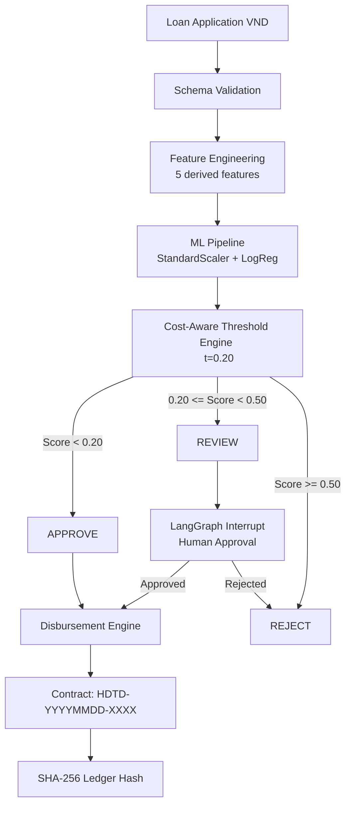

# 🏦 CreditFlow — ML Credit Risk Decision Engine

[](https://python.org)
[](https://fastapi.tiangolo.com)
[](https://reactjs.org/)
[](https://xgboost.readthedocs.io/)
[](https://scikit-learn.org/)
[](https://mlflow.org/)
[](https://www.docker.com/)
[]()
[](LICENSE)

**CreditFlow** is a production-grade ML credit risk decision support system tailored for financial lending. Moving beyond simple notebook exercises, this is a fully deployable decision engine with a complete pipeline: **data validation → feature engineering → model training → evaluation → serving → monitoring**.

Designed with enterprise requirements in mind, it features tamper-evident audit trails, human-in-the-loop approval workflows, explainability, cryptographic decision snapshots, and rigorous cost-sensitive model selection.

## 🚦 Production status (audited 2026-10-09)

| Component | URL | State |
|---|---|---|
| Frontend (GitHub Pages) | https://imtarget05.github.io/CreditFlow/ | Serves the CreditFlow app shell, but the live bundle still targets the Render mirror and business calls are not verified. The revised `cd.yml` will rebuild against Azure after successful CI and Azure gate. `creditflow.pages.dev` serves unrelated content and must not be used. |
| API (Azure Container Apps) | https://creditflow-api.blackisland-5a3f0246.southeastasia.azurecontainerapps.io | `creditflow-api` container app, scale 0-1, /health/live + /health/ready + /model/info verified 2026-10-07 |
| API + Postgres (Render mirror, DB on Neon) | https://creditflow-api-9z1v.onrender.com | Mirror plane from `render.yaml` (Docker web + Neon Postgres via `DATABASE_URL`, set in the Render dashboard), autoDeploy on push |

Owner actions (dashboards — pipeline code is ready):

- Azure: confirm the `creditflow-api` Container App is deployed and the API key has
  been rotated after removing the old key from the Pages bundle; use the Azure
  dashboard to check health and environment configuration.
- GitHub: configure `AZURE_CREDENTIALS` and `CREDITFLOW_API_KEY` as Actions secrets
  for API deployment only. The key is sent to Azure as an ACA secret and used by
  server-side smoke checks; it is never passed to the Pages build/browser bundle.
- Keep the Azure app's existing `CREDITFLOW_ENV` mode unchanged during this
  alignment; production mode intentionally disables simulated CIC/bank gateways
  and requires a separate real-gateway readiness decision.
- The public frontend can score applications, but ledger reads and human approval
  remain locked until a user-authenticated server-side flow is implemented. Do not
  put a shared key in this static frontend.

> **Note — authentication today is one shared API key, not per-user identity.**
> Every sensitive route (ledger reads, state/audit reads, human approval) is
> protected by a single shared secret (`CREDITFLOW_API_KEY`, sent in
> `X-CreditFlow-API-Key`). There is **no user table, no OAuth/OIDC provider and
> no per-user RBAC**: every caller holding the key presents the same principal,
> and the approver identity recorded in the audit trail (`approver_id`) is a
> **deployment-wide configuration value** (`CREDITFLOW_API_KEY_ID`, e.g.
> `supervisor_on_duty`) — it is never the identity of the individual human who
> clicked approve. Consequences, stated honestly: an approval cannot be
> attributed to a specific person, one leaked key gives every holder the same
> authority, and revoking one user means rotating the key for all of them.
> This is sufficient for a portfolio demo plane; it is **not** sufficient for a
> live lending operation. Before a real production go-live the following are
> required: (1) per-user identities via OIDC/OAuth2 or an internal user
> directory, with per-session credentials instead of one shared header secret;
> (2) RBAC mapping an authenticated user to a credit authority level
> (`UNDERWRITER_L1` / `RISK_COMMITTEE_L2`) instead of a single role configured
> per deployment; (3) audit records that log the authenticated user id on every
> approval; (4) per-user revocation and credential rotation.

---

## ✨ Key Features & Engineering Decisions

1. **Business-Driven Model Selection**: Evaluated Logistic Regression, Decision Tree, Random Forest, and XGBoost. The model was selected based on a **custom business cost metric**, not raw accuracy. 
2. **Cost-Sensitive Threshold Tuning**: Optimized for asymmetric costs (False Negative cost=5.0 for missed defaults, False Positive cost=1.0 for wrong rejections), resulting in an optimal decision threshold of `0.20`.
3. **Winning Model**: **Logistic Regression** (Business Cost=201, Recall=0.80, F1=0.57) outperformed XGBoost on the business cost metric and was selected for production.
4. **Robust Feature Engineering**: Engineered 5 derived features (`debt_to_income`, `loan_to_income`, `debt_to_loan`, `employment_stability`, `credit_history_year_ratio`) with zero-division guards and robust handling of edge cases.
5. **Stateful Decision Workflow**: Leverages **LangGraph** for a 12-node state machine (load → gateways → validate → risk → financials → fraud → policy → explain → decision → [human_approval] → execute → audit) that handles human interrupts for `REVIEW` decisions, pausing and resuming workflows asynchronously.
6. **Core-Banking Ledger & Tamper-Evident Decision Snapshots**: Employs SQLite/Postgres ledger with deterministic contract codes (`HDTD-YYYYMMDD-XXXX`), document persistence with SHA-256 artifact verification, and **cryptographic decision snapshots** (`snapshot_hash` SHA-256 digest locking decision ID, application ID, decision, probability, reviewer, timestamp, and model bundle checksum).
7. **Anti-Double-Click Approval Idempotency**: HITL approval endpoint enforces atomic `PENDING_REVIEW` reservation and `idempotency_key` deduplication, preventing race conditions and replay submissions.
8. **Explainable AI**: Deployment duy nhất: **PRIVATE ON-PREM** — lõi Deterministic ML + Rule Engine nội bộ (Rule Filter DTI/LTI + TF-IDF cosine inference), LLM memo chạy Private vLLM nội bộ (Local VPC: `ollama`/`local_vllm`/`private-vllm`). **Policy Guard cứng: data `CONFIDENTIAL` tuyệt đối chặn, không fallback Public Cloud** (OpenAI/Groq/Cloudflare/Anthropic/Google). The LLM *explains*, it does *not* decide. Training = Traditional ML Training from Scratch (LogReg/XGBoost tabular, `colab/train_credit_T4.ipynb`).
9. **Production Monitoring & Drift Domain Events**: Includes **PSI (Population Stability Index)** drift detection against baselines; emits `ModelDriftDetected` domain events to the outbox when distribution shift exceeds threshold.
10. **Model Integrity Verification**: Load-time gate checks model bundle checksum against `SHA256SUMS` and `manifest.json`.
11. **Comprehensive MLOps & Cloud-Native Topology**: Experiment tracking via MLflow; containerized deployments with Kubernetes manifests (`k8s/20-creditflow-api.yaml`) featuring HPA and hardened security profiles (dev-stub manifest — not a live cluster).


---

## 🏗 Architecture

The system orchestrates the flow of a loan application through validation, feature engineering, ML scoring, policy rules, and final disbursement.


```mermaid
graph TD
    A[Loan Application VND] --> B[Schema Validation]
    B --> C[Feature Engineering <br/> 5 derived features]
    C --> D[ML Pipeline <br/> StandardScaler + LogReg]
    D --> E[Cost-Aware Threshold Engine <br/> t=0.20]
    
    E -->|Score < 0.20| F[APPROVE]
    E -->|0.20 <= Score < 0.50| G[REVIEW]
    E -->|Score >= 0.50| H[REJECT]
    
    G --> I[LangGraph Interrupt <br/> Human Approval]
    
    F --> J[Disbursement Engine]
    I -->|Approved| J
    I -->|Rejected| H
    
    J --> K[Contract: HDTD-YYYYMMDD-XXXX]
    K --> L[SHA-256 Ledger Hash]
```

> **Note — `execute()` is a disbursement stub (decision support only).**
> The LangGraph `execute` node (`pipeline/agent/nodes.py`) currently only
> generates the VietQR payload + loan-agreement document and appends audit
> entries to the trail. It does **not** perform any real money transfer —
> CreditFlow is a decision-support system, and the audit message records
> `disbursement pending — no real transfer executed (stub)` to say so
> explicitly. Wiring a real payment rail is a separate, future decision.

---

## 🛠 Tech Stack

| Category | Technologies |
|---|---|
| **Backend** | Python 3.12, FastAPI, Pydantic v2, Uvicorn |
| **ML & Data** | scikit-learn, XGBoost, Pandas, NumPy, Joblib |
| **MLOps & Monitoring** | MLflow 3.16, PSI Drift Detection |
| **Workflow & GenAI** | LangGraph, LangChain, Cloudflare Workers AI (Llama 3.2-1b) |
| **Frontend** | React 18, Vite, Vanilla CSS |
| **Storage & Ledger** | SQLite (with SHA-256 tamper-evident hashing) |
| **DevOps** | Docker, Docker Compose, GitHub Actions, Azure Container Apps, Cloudflare Pages, Render |

---

## 🚀 Quick Start

### Prerequisites
- Python 3.12+
- Node.js 18+
- Docker & Docker Compose (optional but recommended)

### Option 1: Docker Compose (Recommended)
```bash
# Spin up the entire stack (Backend + Frontend + DB)
docker compose up --build -d
```

### Option 2: Local Development
#### Backend
```bash
# Install dependencies
pip install -r requirements.txt

# Start the FastAPI server
uvicorn backend.app:app --reload --port 8080
```

#### Frontend
```bash
# Navigate to frontend and start the dev server
cd frontend
npm install
npm run dev
```

#### MLOps (Training & Tracking)
```bash
# Start the operational MLflow tracking stack (PostgreSQL backend store + artifact volume)
docker compose --profile mlflow up -d

# Run model training pipeline with MLflow tracking (data persists across restarts)
MLFLOW_TRACKING_URI=http://localhost:5050 python scripts/train_models.py

# Or just browse the server that compose started:
# http://localhost:5050
```

---

## 🔌 API Reference

The backend provides a comprehensive REST API for predictions, workflow management, and monitoring.

### Core Endpoints
- `GET /health` - Service health and production model status
- `POST /predict` - Immediate ML prediction (synchronous)
- `GET /model/info` - Production model metadata and benchmark metrics
- `GET /metrics` - Runtime metrics and benchmark table
- `GET /drift` - PSI drift report for monitoring distribution shift
- `GET /llm/info` - Explanation provider status

### Workflow & State Management (LangGraph)
- `POST /predict/graph` - Initiate a full LangGraph decision workflow
- `POST /predict/graph/{thread_id}/approve` - Human approval (resumes a paused `REVIEW` workflow) — **API key required**
- `GET /predict/graph/{thread_id}` - Get current workflow state
- `GET /audit/{application_id}` - Full audit trail for an application

### Ledger & Records
- `GET /api/applications` - List all processed loan applications — **API key required**
- `GET /api/disbursements` - View the core-banking ledger (contracts and hashes) — **API key required**

### Authentication
The money-moving and PII endpoints above take one shared secret in the
`X-CreditFlow-API-Key` header. It comes from the environment only — never
from the repository — and the app **refuses to start** when
`CREDITFLOW_ENV=production` and no key is configured.

```bash
curl -H "X-CreditFlow-API-Key: $CREDITFLOW_API_KEY" \
  -H "Content-Type: application/json" \
  -X POST http://localhost:8080/predict/graph/<thread_id>/approve \
  -d '{"action":"approve"}'
```

| Variable | Purpose | Default |
| --- | --- | --- |
| `CREDITFLOW_API_KEY` | Shared secret for the protected endpoints | none — protected routes answer 401 without it |
| `CREDITFLOW_API_KEY_ID` | Identity recorded as `approver_id` (never taken from the request body) | `supervisor_on_duty` |
| `CREDITFLOW_API_KEY_ROLE` | Credit authority of the key: `UNDERWRITER_L1` or `RISK_COMMITTEE_L2` (from the authority matrix) | `UNDERWRITER_L1` |
| `CREDITFLOW_CORS_ORIGINS` | Comma-separated CORS allow-list; a wildcard is refused | `http://localhost:5173,http://localhost:8080` |

An approval is recorded against the authority the workflow itself demanded:
a `RISK_COMMITTEE_L2` application cannot be approved with an `UNDERWRITER_L1`
key (403, no disbursement written).

> **Known limitation:** the key authenticates a *service or team*, not a person
> — see the shared-API-key note under Production status for what must exist
> (per-user identity + RBAC) before a real production deployment.

---

## 📂 Project Structure

```text
├── backend/
│   ├── app.py              # FastAPI application (CORS, routers, metrics)
│   ├── predict_service.py  # Prediction logic, VND→model units, thresholding
│   └── Dockerfile
├── pipeline/
│   ├── agent/              # LangGraph workflow (12 nodes)
│   │   ├── graph.py        # StateGraph builder
│   │   ├── nodes.py        # 12 discrete workflow nodes
│   │   ├── subagents/      # decoupled specialist agents (underwriting, fraud/compliance, explainability, disbursement)
│   │   ├── policy.py       # Financial policy rules
│   │   ├── fraud.py        # Rule-based fraud detection
│   │   ├── explanations.py # LLM Vietnamese explanations + template fallback
│   │   ├── retriever.py    # TF-IDF policy doc retriever
│   │   └── checkpointer.py # File-backed state persistence
│   ├── financial/          # Basel II/III metrics, risk-based pricing, amortization
│   ├── gateways/           # CIC bureau + bank-statement simulators
│   ├── disbursement/       # VietQR + loan-agreement + authority matrix
│   ├── data/               # Dataset generation + real-data ingestion
│   ├── feature_engineering/ # 5 derived features with edge-case guards
│   ├── modeling/           # Models factory, evaluation, threshold tuning
│   ├── monitoring/         # PSI drift detection
│   ├── storage/            # SQLite core-banking ledger
│   └── validation/         # Canonical schema + validation rules
├── frontend/               # React banking UI with print styling
├── models/production/      # Serialized pipeline + benchmark results + meta
├── notebooks/              # EDA + model benchmark notebooks
├── scripts/                # Training, deploy verification, eval
├── tests/                  # 426 tests (405 fast + 18 slow + 3 production integration; verified baseline below)
├── data/                   # Synthetic dataset (5k rows, seed 42)
├── docker-compose.yml      # Full-stack orchestration
└── render.yaml             # Deprecated preview blueprint (empty)
```

---

## 🧪 Testing

The project maintains a high standard of reliability with a comprehensive test suite.

```bash
python -m pytest tests/ -v
```

The canonical production API is Azure Container Apps. The production
integration tests require the endpoint to be reachable and do not deploy it.

**Previously verified baseline (2026-10-07, clean clone of `b4b031b`):**
426 passed, 0 failed, 0 skipped on Python 3.12.13 with npm available and the
then-configured production service reachable. This is historical baseline data,
not evidence for the Azure rollout changed in this worktree.

| Tier | Tests |
|---|---|
| Fast (`not integration and not slow and not live and not infra`) | 405 |
| Slow (full LangGraph + model runs) | 18 |
| Production integration (`-m integration`) | 3 |

The production integration tests (`tests/test_deploy_pages.py`) may skip when
`npm` is unavailable or the Azure API cannot be reached. That is an
infrastructure-availability condition, not a code regression. `live` / `infra`
tests only run with `LIVE_TESTS=1`.

---

## 📦 Data & Reproducibility

The system was trained on a **5,000-row synthetic proxy dataset** (seed `42`, ~12% default rate). The data generation process is entirely deterministic and reproducible, ensuring honest positioning (acting as a proxy, not real proprietary bank data) while allowing full end-to-end pipeline validation.

---

## ☁️ Deployment — CHỐT: PRIVATE ON-PREM (ENTERPRISE)

- **Deployment duy nhất: PRIVATE ON-PREM** — lõi Deterministic ML + Rule Engine nội bộ, LLM memo chạy Private vLLM nội bộ (Local VPC). Không fallback Public Cloud cho data CONFIDENTIAL.
- **Training**: Traditional ML Training from Scratch trên Colab (`colab/train_credit_T4.ipynb`, LogReg/XGBoost tabular).
- **Processing**: Rule Filter DTI/LTI + TF-IDF cosine inference (local, offline-safe).
- **Policy Guard cứng** (`pipeline/agent/explanations.py:is_public_cloud`): `CONFIDENTIAL` tuyệt đối chặn gửi ra public cloud (OpenAI/Groq/Cloudflare/Anthropic/Google) → route về Private vLLM (`ollama`/`local_vllm`) hoặc deterministic template fallback. Public cloud chỉ dùng cho data PUBLIC hoặc tắt hẳn.
- **Compliance**: Banking Secrecy / GDPR / SBV — CONFIDENTIAL never leaks. Xem `docs/DEPLOYMENT_PRIVATE_ONPREM.md`.
- **Planes**: Azure Container Apps (canonical API) + GitHub Pages (frontend) +
  Render (API + Postgres mirror) = **portfolio demo plane**;
  enterprise deployment target = **PRIVATE ON-PREM** như trên. Public cloud env
  chỉ dành cho data PUBLIC.

---

## 🛡️ Decision Safety (plan 2026-09-18)

- **Versioned model bundle**: `models/production/manifest.json` khoá SHA-256 của
  từng artifact + metadata hợp đồng (`feature_order`, `vnd_per_model_unit`).
  Startup validate bundle — thiếu/sai hợp đồng → 503 `MODEL_BUNDLE_INVALID`.
- **Replay-safe approval**: `POST /predict/graph/{thread}/approve` là một
  transaction (reserve `PENDING_REVIEW` + `approver_id` + `idempotency_key`,
  resume graph, chỉ disburse khi `APPROVE`). `UNIQUE(disbursements.application_id)`
  + idempotency key đảm bảo **một hồ sơ = một dòng tiền**; duplicate approval
  trả receipt cũ (`replay: true`).
- **Explicit failures**: model/gateway/checkpoint lỗi → `workflow_status=FAILED`
  + `error_code` (503), không bao giờ tạo row `PENDING_REVIEW`. Simulator gắn
  `source_mode=SIMULATION` và bị chặn khi `CREDITFLOW_ENV=production`.
- **Checkpoint JSON-only**: file hỏng được quarantine (timestamp) và health
  báo `CHECKPOINT_CORRUPT` thay vì âm thầm bỏ qua.

Chi tiết vận hành: `docs/DEPLOYMENT_PRIVATE_ONPREM.md` (§6).

---

## 🗃 MLflow Tracking (Self-Hosted, Local)

Self-hosted MLflow 3.16 tracking stack for local development: **PostgreSQL 16** as
the backend store + **MLflow server** as the artifact/metadata store. Persists
experiments, runs, params, metrics, tags, registry entries and model artifacts across
container restarts (Postgres + artifact volume survive `restart`/`down`-`up`).

### Compose

```bash
# start only the MLflow profile
docker compose --profile mlflow up -d

# tracking URI the training client must use
export MLFLOW_TRACKING_URI=http://localhost:5050
```

Services (compose `profiles: ["mlflow"]`):
- `postgres-mlflow` — PostgreSQL 16, named volume `mlflow-postgres` → backend store.
- `mlflow` — image `ghcr.io/mlflow/mlflow:v3.16.0`, runs `mlflow server --host 0.0.0.0 --port 5000`
  with `--backend-store-uri postgresql+psycopg2://...@postgres-mlflow:5432/...` and
  `--default-artifact-root /tmp/creditflow-mlflow-artifacts` (host bind mount).

Server URL: `http://localhost:5050` (host port 5050 → container port 5000).

### Verification

```bash
MLFLOW_TRACKING_URI=http://localhost:5050 scripts/verify_mlflow.py
# exit 0 when experiment / runs / parameters / metrics / artifacts / registry all present
```

### Env variables (`mlflow` profile only; gitignored placeholders)

See `.env.example`. `MLFLOW_TRACKING_URI` is a **client** env var for the Python training
process — it is not server configuration:

| Variable | Default | Meaning |
|---|---|---|
| `MLFLOW_TRACKING_URI` | `http://localhost:5050` | server URI used by the training client |
| `MLFLOW_DB_USER` | `mlflow` | Postgres backend store user |
| `MLFLOW_DB_PASSWORD` | `mlflow-dev-only` | **never commit real value**; set in `.env` |
| `MLFLOW_DB_NAME` | `mlflow` | Postgres backend store database |

### Notes / gotchas

- `MLFLOW_TRACKING_URI` must be exported on the **client** (the machine running
  `scripts/train_models.py`), not inside the compose file.
- On each training run the production bundle is regenerated; commit
  `models/production/manifest.json`, `meta.json`, `SHA256SUMS` and `reference_stats.json`
  alongside the model artifact (`pipeline.joblib`) — use
  `scripts/check_artifacts.py --build --dir models/production` to refresh the SHA-256 manifest.

