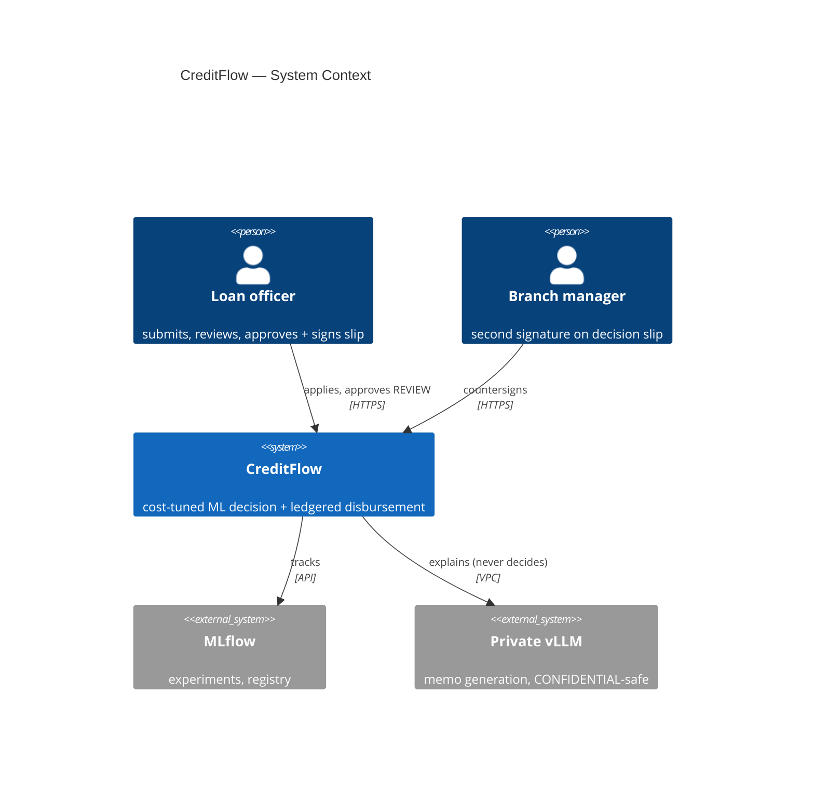
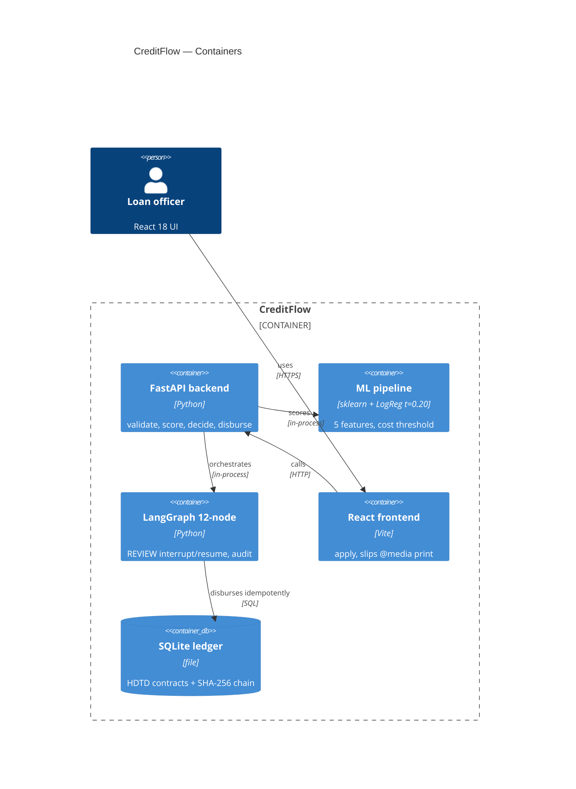

# CreditFlow — C4 Architecture

> Source of truth: `CreditFlow/README.md` architecture diagram
> (validate → features → ML → threshold → LangGraph → disbursement → ledger).
> Private on-prem deployment: CONFIDENTIAL never leaves the VPC.

## C4-Context

## C4-Container

