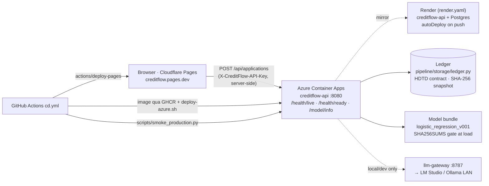
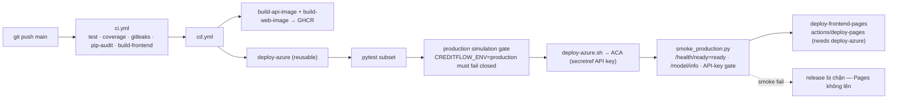
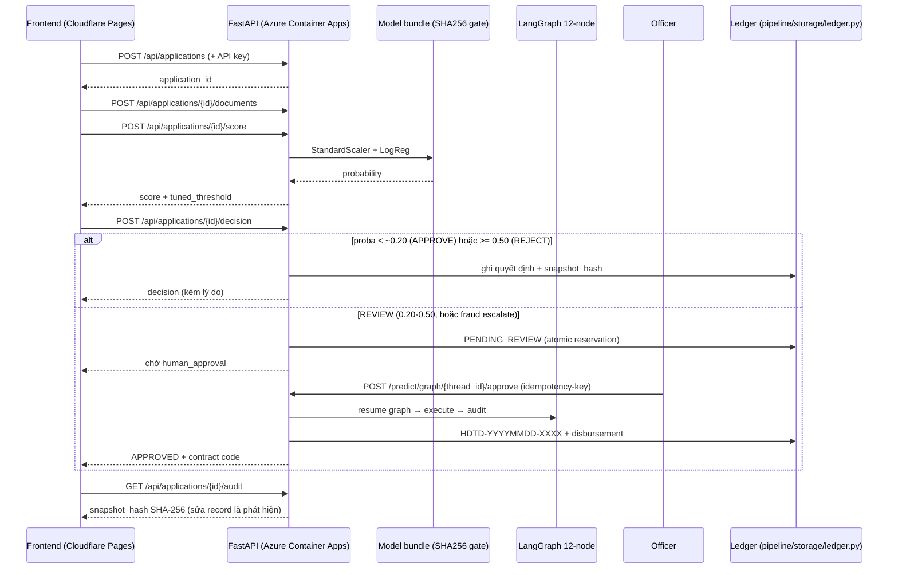
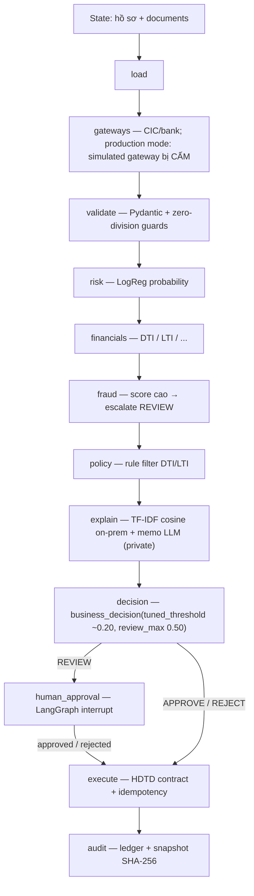

# System Architecture: CreditFlow

> Bản đồ kiến trúc CreditFlow: **service map → hạ tầng cloud → DevOps → luồng API → luồng AI/ML**.
> Mọi URL/cổng/gate trích từ code và workflow thật; phần "target" của hồ sơ Azure enterprise được đánh
> dấu riêng, không trộn vào hiện trạng. Trạng thái production: `README.md` → *Production status*;
> deploy chi tiết: `docs/deployment.md`; quyết định hạ tầng: `docs/adr/`.

## 1. Business Problem & Mission

CreditFlow tự động hoá quy trình cho vay: hồ sơ vào → chấm điểm rủi ro bằng ML → quyết định theo
**cost kinh doanh** (FN=5 > FP=1) → hồ sơ mờ dừng cho con người duyệt → ra hợp đồng số hiệu + sổ cái chống sửa.

```text
[POST /api/applications — hồ sơ vay]
        │
        ▼
[Pydantic V2 validation + Feature Engineering]
  5 feature suy ra: DTI · LTI · debt_to_loan · employment_stability · credit_history_year_ratio
        │
        ▼
[StandardScaler + logistic_regression_v001 — checksum SHA256SUMS kiểm lúc LOAD]
        │  probability
        ▼
[business_decision — pipeline/modeling/threshold.py]
  proba < tuned_threshold (~0.20) ───────────► APPROVE
  tuned_threshold ≤ proba < 0.50  ───────────► REVIEW ──► human_approval interrupt
  proba ≥ 0.50                    ───────────► REJECT
  (fraud_score cao → escalate lên REVIEW, không tự REJECT)
        │
        ▼
[execute] hợp đồng HDTD-YYYYMMDD-XXXX + idempotency-key chống bấm đôi
        │
        ▼
[audit] ledger pipeline/storage/ledger.py + snapshot_hash SHA-256
```

**Core engineering promise:** *"Tôi vận hành được ML bên trong quy trình kinh doanh có kiểm soát pháp lý,
audit được — LLM giải thích, không quyết định."*

## 2. Service map (hiện trạng — code thật)

| Service | Tech | Cổng | Chạy ở đâu | Health / chú thích |
|---|---|---|---|---|
| `web` (SPA) | React 18 + Vite (nginx trong compose) | 80 (compose) | **Prod: Cloudflare Pages** `https://creditflow.pages.dev/`; local: nginx serve `dist/` + proxy `/api` | deploy bởi `cd.yml` → `cloudflare/wrangler-action` (pages deploy) |
| `api` | FastAPI, Python 3.12 | **8080** trong container (compose map `8081→8080`) | local: Docker; **Prod: Azure Container Apps** `creditflow-api.blackisland-5a3f0246.southeastasia.azurecontainerapps.io` (scale 0–1) | `/health`, `/health/live`, `/health/ready` (readiness = `status=ready`), `/model/info` |
| `llm-gateway` | FastAPI proxy OpenAI-compatible | **8787** | máy LAN (bind loopback) → upstream LM Studio `192.168.1.8:1234` + Ollama fallback | `/health`, `/health/ready`, `/metrics`, `/admin/stats`; client trỏ `base_url=localhost:8787/v1`, header `X-Project` phân loại telemetry |
| `mlflow` (compose profile `mlflow`) | MLflow tracking | 5050 | local-only, không public | `MLFLOW_TRACKING_URI=http://localhost:5050` |
| Ledger | `pipeline/storage/ledger.py` (SQLite default / Postgres) | — | cùng process `api` (`data/creditflow_ledger.db` local) | canonical runtime ledger theo **ADR-007**; `src/creditflow/ledger/` là prototype non-canonical |
| Model bundle | `models/` + `SHA256SUMS` + `manifest.json` | — | đóng gói vào image; verify lúc load | sai checksum → không vào serving; xem `/model/info` |

## 3. Hạ tầng cloud (verified) — đường request thật



**Ranh giới bí mật:** `CREDITFLOW_API_KEY` chỉ tồn tại ở GitHub Actions secret → đẩy xuống ACA dạng
secret (`secretref` trong `deploy/scripts/deploy-azure.sh`), chỉ dùng server-side cho smoke;
**frontend không nhúng key** (key cũ đã gỡ khỏi bundle Pages). Endpoint ledger/audit/approve đều bắt xác thực.

### Dual deployment profiles (bảng thiết kế — hiện trạng verified ở mục 3)

| Dimension | `PROFILE=portfolio` (Demo) | `PROFILE=production` (Azure enterprise — mục tiêu) |
|---|---|---|
| Primary Cloud | Cloudflare Pages (frontend) + Azure Container Apps (API) + Render mirror ($0) | Azure Container Apps (`min_replicas=0`, scale-to-zero) |
| Document Storage | Local filesystem / Cloudflare R2 | Azure Blob (`credit-documents`, SSE AES-256) |
| Model Registry | Local weights + MLflow self-hosted (5050) | Azure Blob (`ml-models`) + MLflow Tracking |
| Database | SQLite WAL (default) | Azure Database for PostgreSQL Flexible Server |
| Identity & Secrets | `.env` | Azure Key Vault + User-Assigned Managed Identity |

## 4. DevOps / CI-CD (workflow thật trong `.github/workflows/`)

| Workflow | Trigger | Jobs | Gate / kết quả |
|---|---|---|---|
| `ci.yml` | push, PR | `test` · `test-slow` · `coverage` · `gitleaks` · `pip-audit` · `build-frontend` | pytest fast + slow; secret scan; dependency audit; build frontend |
| `cd.yml` | push `main` | `build-api-image` → GHCR · `build-web-image` → GHCR · **`deploy-azure`** (reusable) · `deploy-frontend-pages` (**needs: deploy-azure**) | Pages **không deploy nếu Azure chưa xong** |
| `deploy-azure.yml` | `workflow_call` / dispatch | `test-and-deploy` | ① pytest subset `not integration/slow/live/infra` ② **production simulation gate**: `CREDITFLOW_ENV=production` phải ném `GATEWAY_UNAVAILABLE` (fail closed) ③ `azure/login` ④ `deploy/scripts/deploy-azure.sh` (build+deploy ACA, set secret) ⑤ **smoke thật**: `scripts/smoke_production.py` → `/health/live`, `/health/ready`=ready, `/model/info`, endpoint khóa API-key ⑥ thiếu `AZURE_CREDENTIALS` → **job FAIL** (không phải skip xanh giả) |
| `build-container.yml` | push | build/publish image GHCR | image artifact độc lập |
| `ci-live.yml` | manual | live/infra tests | chạy chủ động, không auto |
| `llm-gateway.yml` | push/PR/dispatch | `test` · `live-tests` · `observability-config` | gateway proxy + telemetry |
| `keepalive.yml` | schedule | ping | giữ dịch vụ free-tier không cold-stop |



## 5. Luồng API end-to-end

### Endpoint map (`backend/app.py` — mọi route đều có alias `/api/...`)

| Nhóm | Method + Path | Ghi chú |
|---|---|---|
| Health | `GET /health` · `GET /health/live` · `GET /health/ready` | readiness trả `status=ready` — smoke dùng làm gate |
| Ứng tuyển | `POST /api/applications` · `GET /api/applications` · `GET /api/applications/{id}` | Pydantic V2; bắt API key server-side |
| Hồ sơ | `POST /api/applications/{id}/documents` · `GET .../documents` | upload + list giấy tờ |
| Chấm điểm | `POST /api/applications/{id}/score` | feature engineering + LogReg probability |
| Quyết định | `POST /api/applications/{id}/decision` | APPROVE/REVIEW/REJECT; REVIEW → `PENDING_REVIEW` |
| Giải thích | `GET /api/applications/{id}/explanation` | rule filter + TF-IDF cosine (on-prem) |
| Audit | `GET /api/applications/{id}/audit` · `GET /audit/{application_id}` | snapshot SHA-256 |
| Graph (LangGraph) | `POST /predict/graph` · `GET /predict/graph/{thread_id}` · `POST /predict/graph/{thread_id}/approve` | chạy nguyên 12-node; state theo `thread_id`, approve/resume tại đây |
| Sổ cái | `GET /api/disbursements` | hợp đồng `HDTD-YYYYMMDD-XXXX`, idempotency-key (ADR-0001) |
| Giám sát | `GET /drift` (PSI) · `GET /model/info` · `GET /llm/info` · `GET /metrics` · `GET /metrics/prometheus` | PSI vượt ngưỡng → event `ModelDriftDetected` |

### Sequence: hồ sơ vay đi hết hệ thống



## 6. Luồng AI/ML/LLM (ML quyết định, LLM chỉ giải thích)



- **12 node** đúng thứ tự `load → gateways → validate → risk → financials → fraud → policy → explain →
  decision → human_approval → execute → audit` (`pipeline/agent/nodes.py`, `pipeline/agent/graph.py`).
- **Chọn model theo cost, không theo accuracy:** `cost = 5·FN + 1·FP` — LogReg thắng XGBoost
  (business cost 201, recall 0.80 @ t=0.20).
- **Policy LLM cứng:** quyết định là deterministic ML + rules; memo LLM chạy private
  (`ollama` / `local_vllm` / `private-vllm` qua `llm-gateway :8787`); data `CONFIDENTIAL` **chặn cứng**
  mọi fallback ra OpenAI/Groq/Cloudflare/Anthropic — không có "fallback PUBLIC" âm thầm.
- **Guardrail production:** `CREDITFLOW_ENV=production` mà gọi được gateway mô phỏng →
  `RuntimeError(GATEWAY_UNAVAILABLE)` — gate này chạy ngay trong CI (`deploy-azure.yml`) trước khi deploy.
- **Drift (MLOps):** PSI hằng ngày so baseline; PSI ≥ 0.25 → event `ModelDriftDetected` ra outbox;
  model bundle sai `SHA256SUMS` → không bao giờ vào serving.

## 7. Clean Architecture Layering (giữ nguyên ranh giới)

```
Domain  ◄──  Application  ◄──  Infrastructure  ◄──  Presentation
```

| Layer | Component | Mô tả |
|---|---|---|
| **Domain** | `backend/models.py` | `Application`, `CreditScore`, `RiskAssessment`, `ApprovalDecision` — không phụ thuộc cloud/framework |
| **Application** | `backend/predict_service.py` | use cases: scoring, policy validation, drift, human escalation |
| **Infrastructure** | `backend/security.py`, `pipeline/storage/ledger.py`, `infra/` | adapters: ledger, model loader, blob/Postgres, telemetry |
| **Presentation** | `backend/app.py`, `frontend/` | FastAPI router, Pydantic schemas, underwriter dashboard |

## 8. Key Architectural Decisions (ADRs)

1. [ADR-001: Container Apps thay vì AKS](adr/ADR-001-why-container-apps-not-aks.md) — serverless container, không trả phí cluster idle.
2. [ADR-002: Azure Service Bus thay vì Kafka](adr/ADR-002-why-service-bus-not-kafka.md) — transaction + duplicate detection hợp workflow vay hơn là stream telemetry.
3. [ADR-004: Azure Blob vs Cloudflare R2](adr/ADR-004-blob-vs-r2.md) — hồ sơ nhạy cảm + model checkpoint cần private blob + SAS.
4. [ADR-005: Render Preview Environment](adr/ADR-005-render-preview-environment.md) — plane demo ephemeral, dán nhãn trung thực (không nói HA giả).
5. [ADR-006: Terraform là authoritative tree](adr/ADR-006-terraform-authoritative-tree.md).
6. [ADR-007: `pipeline/storage/ledger.py` là canonical runtime ledger](adr/ADR-007-canonical-runtime-ledger.md) — `src/creditflow/ledger/` là prototype non-canonical.
7. [ADR-0001: Idempotency-key cho disbursement](adr/0001-idempotency-key-disbursement.md) — chống double-click lệnh tiền.


