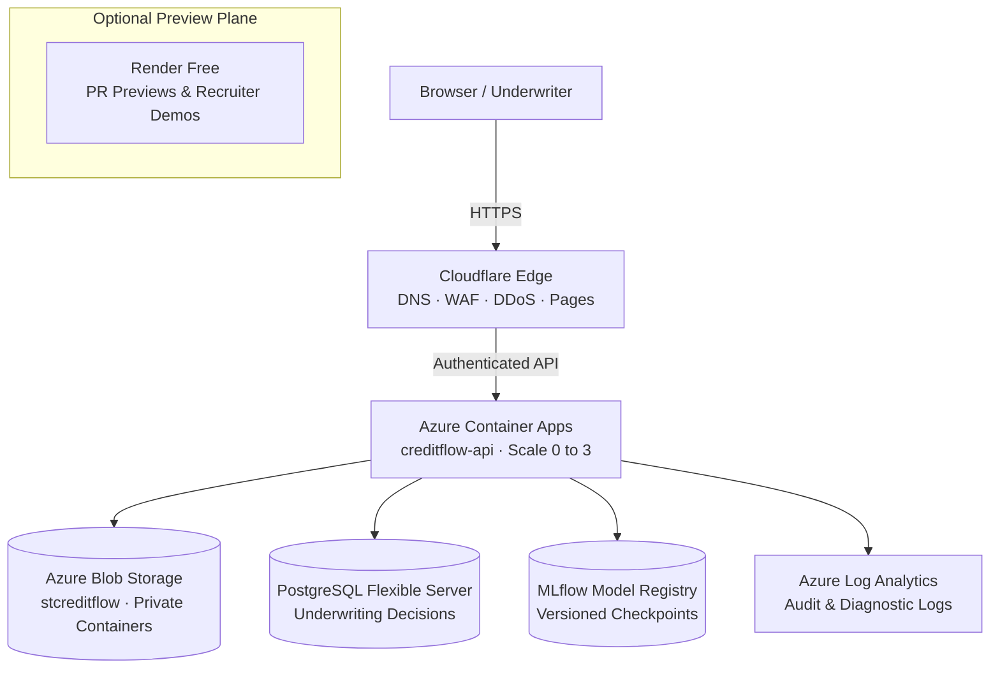

# System Architecture: CreditFlow

## 1. Business Problem & Mission

CreditFlow automates loan origination and risk assessment while strictly upholding banking regulatory compliance, fair lending statutes, and operational transparency:

```
[Loan Application Submitted]
             │
             ▼
   [Document Ingestion & Verification] (Tax returns, bank statements, income proof)
             │
             ▼
   [Feature Engineering & Pipeline] (Debt-to-Income, FICO, cash flow volatility)
             │
             ▼
   [ML Risk Scoring & Rule Engine] (XGBoost / LightGBM default prediction)
             │
             ├── High Confidence (Score >= 720) ─────────► [Automated Approval]
             │
             ├── Low Confidence (Score < 600)  ──────────► [Adverse Action / Denial with Reason]
             │
             └── Borderline Risk (600 <= Score < 720) ──► [Human-in-the-Loop (HITL) Gate]
                                                                    │
                                                          [Underwriter Decision]
```

**Core Engineering Promise:**
> *"I can operationalize machine learning inside a legally controlled, auditable business workflow."*

---

## 2. Clean Architecture Layering

```
Domain  ◄──  Application  ◄──  Infrastructure  ◄──  Presentation
```

| Layer | Component | Description |
|---|---|---|
| **Domain** | `backend/models.py` | Entities: `Application`, `CreditScore`, `RiskAssessment`, `ApprovalDecision`. No cloud or framework dependencies. |
| **Application** | `backend/predict_service.py` | Ports & Use cases: scoring orchestration, policy rule validation, drift calculation, human escalation logic. |
| **Infrastructure** | `backend/security.py`, `infra/` | Adapters: Azure Blob Storage (`azure-storage-blob`), MLflow model loader, SQLite/PostgreSQL, telemetry. |
| **Presentation** | `backend/app.py`, `frontend/` | Composition roots: FastAPI router, request validation schemas, underwriter dashboard. |

---

## 3. Hybrid-Cloud Infrastructure Design



### Dual Deployment Profiles

| Dimension | `PROFILE=portfolio` (Demo) | `PROFILE=production` (Azure Enterprise) |
|---|---|---|
| **Primary Cloud** | Render Web Service ($0 tier) + Cloudflare Pages | Azure Container Apps (`min_replicas = 0`, scale-to-zero) |
| **Document Storage** | Local filesystem / Cloudflare R2 | Azure Blob Storage (`credit-documents`, SSE AES-256) |
| **Model Registry** | Local packaged `.joblib` / `.bin` weights | Azure Blob Storage (`ml-models`) + MLflow Tracking |
| **Database** | SQLite with WAL mode enabled | Azure Database for PostgreSQL Flexible Server |
| **Identity & Secrets** | Environment variables (`.env`) | Azure Key Vault + User-Assigned Managed Identity |

---

## 4. Key Architectural Decisions (ADRs)

1. [ADR-001: Why Container Apps instead of AKS](file:///Users/mainguyenbinhtan/Downloads/TMA/CreditFlow/docs/adr/ADR-001-why-container-apps-not-aks.md) — Serverless container compute avoids $73/mo idle cluster fees while retaining K8s compatibility.
2. [ADR-002: Why Azure Service Bus over Kafka](file:///Users/mainguyenbinhtan/Downloads/TMA/CreditFlow/docs/adr/ADR-002-why-service-bus-not-kafka.md) — Transactional message guarantees and duplicate detection match loan workflows better than high-throughput telemetry streams.
3. [ADR-004: Azure Blob Storage vs Cloudflare R2](file:///Users/mainguyenbinhtan/Downloads/TMA/CreditFlow/docs/adr/ADR-004-blob-vs-r2.md) — Private Azure Blob Storage with SAS tokens protects sensitive loan dossiers and model checkpoints.
4. [ADR-005: Render Preview Environment](file:///Users/mainguyenbinhtan/Downloads/TMA/CreditFlow/docs/adr/ADR-005-render-preview-environment.md) — Ephemeral recruiter demo plane labeled truthfully without false HA claims.
